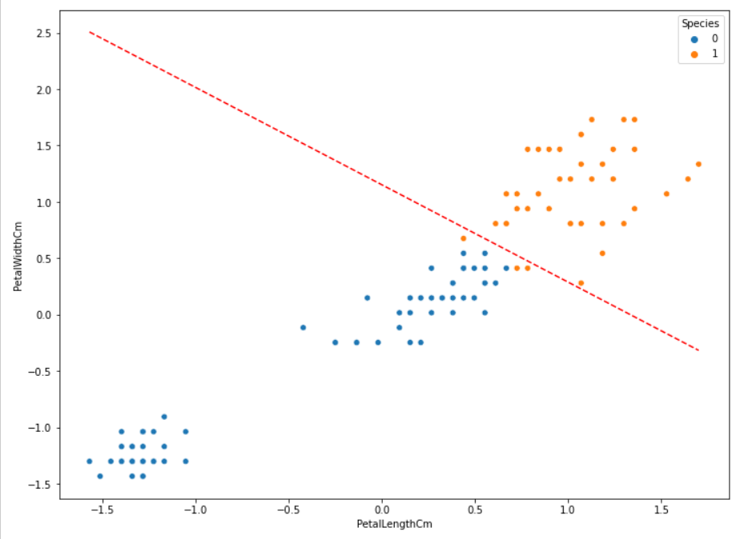

# Hasil Belajar

Summary:
- Ketika kita membuat model Logistic Regression (binary classification), kita itu cuma bikin satu model aja untuk nge prediksi class 1. Nanti untuk mencari nilai proba dari class 0 tinggal 1 - proba_class_1
- Ketika kita melakukan Multiclass Classification (kasus nya Iris), kita itu bikin 3 model.
  - Virginica vs Non Virginica
  - Setosa vs Non Setosa
  - Versicolor vs Non Versicolor
- Kita bisa extract parameter `coef_` dan `intercept_` untuk digunakan membuat Decision Boundary
- Untuk membuat Decision Boundary, kita membutuhkan garis lurus. Kita bisa menggunakan rumus turunan dari fungsi Sigmoid. Detail nya ada [disini](https://jamboard.google.com/u/2/d/1InW1wGqzsd0JmKNTGvWo7ir1Ku7hWXm2s6Tj83bdXc4/viewer?f=3)
- Sehingga kita tinggal plug in aja nilai parameter yang sudah kita modeling kan
- Setelah melakukan eksperimen menggunakan scaling dan tidak menggunakan scaling didapatkan hasil:
  - Secara overall, bentuk dari Decision Boundary nya masih sama, cuma beda scale atau range data nya aja
  - Apakah karena range data nya tidak begitu jauh sehingga tidak begitu berpengaruh? 
  - Tetapi menariknya adalah hasil metrics accuracy tanpa di scaling jauh lebih bagus daripada yang menggunakan scaling 
- When to use LabelEncoder or One Hot Encoding:
  - Menggunakan LabelEncoder jika binary classification, karena hasilnya kalo tidak class 1 ya class satunya
  - Menggunakan One Hot Encoding jika multiclass classification, karena kalo pake LabelEncoder hasilnya bisa bias. Ex:
    - Prancis (0)
    - Indo (1)
    - Jepang (2)
      model ada yg nge prediksi kalo Indo > Jepang. Padahal semua negara itu setara (jika tanpa ada parameter tambahan)
      
### Decision Boundary with Scaling

### Decision Boundary without Scaling

